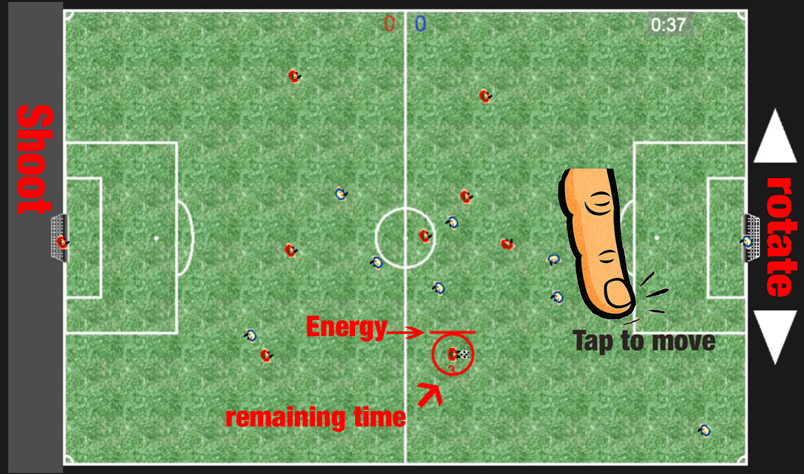

# Ralfs Rumgekicke (Soccer Game)

A fast-paced, web-based soccer game built with JavaScript. Play against the computer or a friend, and experience the thrill of the pitch right in your browser.

## Game Instructions

### Desktop Controls
- **Move**: Use the arrow keys `↑` `↓` `←` `→` to navigate your player. Note: Movement is limited once the colored energy bar above the player's head is depleted.
- **Rotate**: Use `Page Up`, `Page Down`, `.`, or `-` to rotate your player and aim your shot.
- **Shoot**: Hold the `Space` bar to build power, and release it to shoot the ball. The longer you hold, the further the shot.
- **Pause**: Press `ESC` to pause the game.

### Mobile / Touch Controls
- **Movement & Aiming**: Use the touch areas on the screen to control your player's movement and rotation.
- **Shooting**: Tap and hold the shooting zones (areas behind the goals) to charge your shot, then release to kick.
- **Pause**: Double-tap the screen to pause the game.

### Gameplay Mechanics 
- **Match Duration**: Each game lasts for **5 minutes**.
- **Time with ball**: Is limited to 8 seconds. 
- **Action Boost**: On touch devices, the "Action Boost" option is enabled, which increases the time with ball and the distance moving the player.
- **Energy (Puste)**: Players have a limited amount of energy for sprinting and powerful shots. Energy is indicated by the colored bar above the player.
- **next player**: The closest player to the ball gets it.
- **Self-Pass (Vorlegen)**: A player is allowed to "pass the ball to themselves" **once**. After that, they must pass to a teammate or shoot, or another player must take possession before they can control the ball again. If a player tries to control the ball a second time in a row, their energy will be halved and they will be locked from further immediate possession.
- **pause between change (Wechselpause)**: 2-4 seconds time to change Keyboard or device when playing against a friend.

## License

### Source Code
This project is licensed under the [Creative Commons Attribution-NonCommercial 4.0 International License](https://creativecommons.org/licenses/by-nc/4.0/).
You may use, modify, and share the code for non-commercial purposes only. **Attribution is required.**

### Assets (Graphics, Sound, Music)
All assets are **© 2026 Ralf Viellieber**. All rights reserved.
They may not be used, copied, modified, or redistributed without permission.
